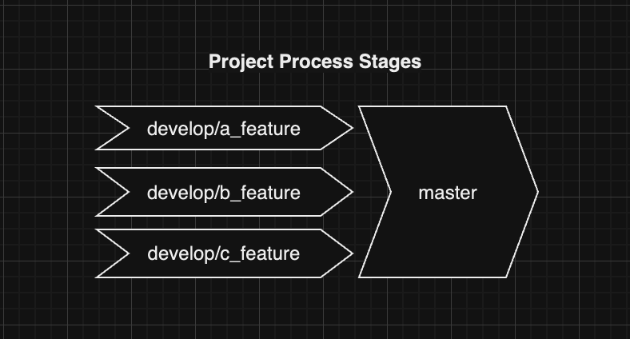

## With pip <small>for general usage</small> { #with-pip data-toc-label="with pip" }

[**_pip_**](https://pip.pypa.io/en/stable/) is a Python package management tool. We could install all the Python packages
which be managed in [**PyPI**](https://pypi.org/) platform. So we also could install **_PyFake-API-Server_** via pip as below command:

```console
pip install fake-api-server
```

However, it may have something problems:

* It would install all the dependencies which may includes something you don't need. 

So it recommends that installs **_PyFake-API-Server_** by pip with option to install the necessary dependencies only.

```console
pip install "fake-api-server[<web framework>]"
```

The dependencies which are necessary to install decreases greatly.

!!! tip "What the options _web framework_ we could use?"

    **_PyFake-API-Server_** uses the Python web framework to implement
    the API feature. It means that it would also depend on other
    Python package which for web development. Currrently, it supports
    2 frameworks of all popular Python web framerworks --- [**_Flask_**]
    and [**_FastAPI_**]. So the options value we could use are: ``mini``,
    ``flask`` or ``fastapi``.
    
    | Strategy name | Purpose                                                                                                                                |
    |:--------------|:---------------------------------------------------------------------------------------------------------------------------------------|
    | `mini`        | Install the minimum level dependency of Python package. It means it won't install both of web frameworks **_Flask_** or **_FastAPI_**. |
    | `flask`       | Install the dependencies includes [**_Flask_**] and [**_Gunicorn_**].                                                                  |
    | `fastapi`     | Install the dependencies includes [**_FastAPI_**] and [**_Uvicorn_**].                                                                 |
    
    [**_Flask_**]: https://flask.palletsprojects.com/en/2.3.x/
    [**_Gunicorn_**]: https://docs.gunicorn.org/
    [**_FastAPI_**]: https://fastapi.tiangolo.com
    [**_Uvicorn_**]: https://www.uvicorn.org/


## With poetry <small>recommended for Python developer</small> { #with-poetry data-toc-label="with poetry" }

If you're familiar with Python, it strongly recommends that use [**Poetry**] to manage your Python project includes installing
this package.

[**Poetry**]: https://python-poetry.org/docs/

??? question "So what is Poetry ...?"
    
    If you still miss your direction about how to manage your Python
    project, you must try to use **_Poetry_** to do it. Poetry is a
    tool for managing your Python project includes the deeply complex
    relations of Python dependencies.
    
    Let's quickly demonstrate the general usage of Poetry to you.
    
    If you want to add a new dependency, in the other words, install
    a new Python package, it doesn't use ``pip``, use ``poetry`` to
    add it.
    
    ```console
    poetry add <Python package>
    ```
    
    How easy it is! Isn't it? It's also easy for removing dependency:
    
    ```console
    poetry remove <Python package>
    ```
    
    So what's the difference between **_Poetry_** and **_pip_**? The
    major difference is **_Poetry_** could be greatly better to manage
    your dependencies! Let's consider a scenario. If a package A which
    depends on pacakge B, it would also install package B when it installs
    pacakge A. However, about removing this package, it's a trouble when
    you use **_pip_** because **_pip_** won't remove package B when you
    remove package A! You need to manually remove package B if you want
    to remove them clearly. If your project is huge, it's also a big
    problem of managing your project's dependencies. And the poetry is
    a great solution to resolve this issue. Poetry even sorts out the
    dependencies relations as a tree diagram and illustrate it as following:
    
    ```console
    >>> poetry show --tree --without=dev
    fastapi 0.95.2 FastAPI framework, high performance, easy to learn, fast to code, ready for production
    ├── email-validator >=1.1.1
    │   ├── dnspython >=2.0.0
    │   └── idna >=2.0.0
    ├── httpx >=0.23.0
    │   ├── certifi *
    │   ├── httpcore >=0.15.0,<0.18.0
    │   │   ├── anyio >=3.0,<5.0
    │   │   │   ├── idna >=2.8
    ...
    ```
    
    How clear it is! So Poetry is a very powerful tool for manage your
    Python project.


The installing command is little different with ``pip`` but be similar:

```console
poetry add fake-api-server
```

It also could install necessary parts of dependencies only.

```console
poetry add "fake-api-server[<web framework>]"
```

It should add one more dependency **_PyFake-API-Server_** in your configuration _pyproject.toml_.

## With git

If you want to use the latest features of **_PyFake-API-Server_**, you could use ``git`` to clone the project's source code first.

```console
git clone https://github.com/Chisanan232/PyFake-API-Server.git ./pymock-server -b <git branch>
```

!!! note "The dividing rule of git branch"

    It apply Trunk-base developmenet at **_PyFake-API-Server_** project and its trunk branch is **_master_**.:

    
    
    * develop
        * Git branch: _develop/**_
        * Majot process: All the development should base on this branch to work. The code of this branch always be latest
        but also unstable.
    * master
        * Git branch: _master_ (it's also trunk branch)
        * Majot process: The final code to release to PyPI incudes documentation. The code of this branch is stablest and
        it also be same as the code in PyPI.


After source code be ready, you could install it by ``pip``.

```console
pip install -e fake-api-server
```

## With _Docker_ <small>for general usage without Python runtime environment</small> { #with-docker data-toc-label="with Docker" }

If your runtime environment has not installed Python and you won't use Python temporarily, you also could use [**Docker**] to
enjoy **_PyFake-API-Server_**.

[**Docker**]: https://hub.docker.com/repository/docker/chisanan232/pyfake-api-server/general

Download **_PyFake-API-Server_** official image as below:

```console
docker pull fake-api-server:v0.1.0
```

??? tip "Recommended: Use the tag to manage your Docker image"

    You could use command line ``docker pull fake-api-server`` without tag
    absolutely. But the default tag is ``latest``. That means you cannot
    clear what version you have currently. So it recommends using tag
    to manage it and clear what version it use currently by yourself.

Verify the Docker image has been exactly installed:

```console
docker images fake-api-server
```


## Verify the command line feature

No matter which way to install **_PyFake-API-Server_**, it must verify whether the command line tool is ready for working or not.

```console
mock --help
```

If it outputs some usage info about the command ``mock``, congratulation! You could start to enjoy easily and quickly
mock API.
